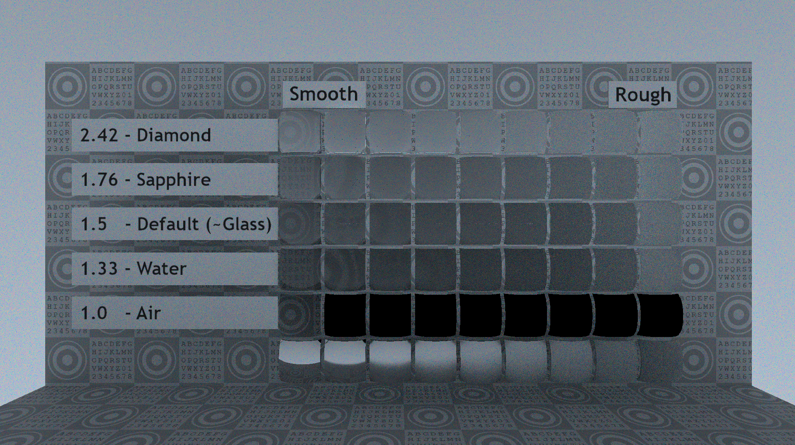
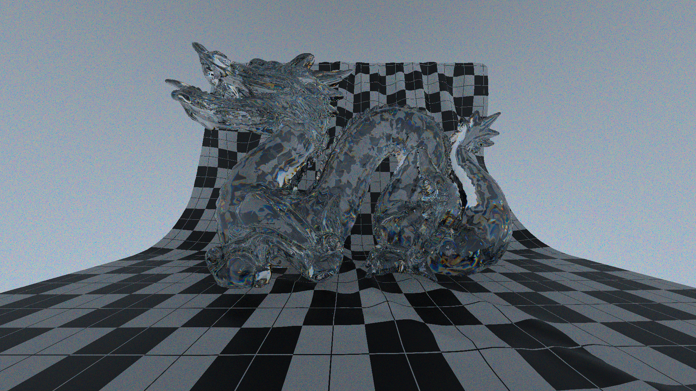

# CrystalGraphics

A "real-time" _spectural_ _pathtracing_ rendering engine written with `C++23` & `glm` & `Webgpu`.

| | |
|-|-|
|||
|||

## QuickStart

```cpp
#include <cstdlib>

#include <chrono>
#include <expected>
#include <iostream>

#include <CrystalGraphics/graphics.h>

/**
 * Extract the value from a `std::expected` if the value is present, otherwise
 * terminate the program.
 */
template <typename T>
T ExpectedVal(std::expected<T, std::string>&& expected) {
  if (!expected) [[unlikely]] {
    std::cerr << expected.error() << std::endl;
    exit(EXIT_FAILURE);
  }
  if constexpr (!std::is_same_v<T, void>) return std::move(*expected);
}

/**
 * Main function.
 */
int main() {
  /* Initialize environment. */
  ExpectedVal(crystal::graphics::EnvInit());
  auto scene = ExpectedVal(crystal::graphics::LoadScene(
      R"(path/to/your/scene.gltf)" // replace this with your gltf file!
  ));

  /* Run for some seconds. */
  crystal::graphics::Camera camera{
    .position = { 0.0, -2.0, 0.0f },
    .direction = { 0.0, 1.0, 0 },
    .viewport = { 1.960, 1.080 }
  };
  uint64_t counter = 0; // frame counter
  auto st = std::chrono::high_resolution_clock::now();
  while (std::chrono::high_resolution_clock::now() - st
         < std::chrono::seconds(30)) {
    ExpectedVal(crystal::graphics::EnvPoll()); // poll window
    ExpectedVal(crystal::graphics::View(scene, camera)); // render frame
    ExpectedVal(crystal::graphics::EnvPresent()); // present frame
    counter++;
  }
  std::cout << "Frame Count: " << counter << std::endl;

  /* Terminate environment. */
  ExpectedVal(crystal::graphics::EnvTerm());

  return EXIT_SUCCESS;
}
```

## Features

* Spectral Pathtracing with Wavelength Sampling
* CIE XYZ color space
* Diffuse & (Rough/Specular) Reflection & Transmission BSDF Model
* glTF Scene Loading
* BVH software acceleration
* WebGPU Compute Backend

## Build & Integration

### Standalone Build

A standalone build will create a executable in your build directory that renders a glTF scene with a few customizable arguments.

### Library Integration

The recommended way to integrate this library is with the `CMake` build system:

```shell
git clone https://github.com/ray847/CrystalGraphics.git --depth 1
```

```cmake
add_subdirectory(path/to/cloned/repo)

target_link_libraries(YourTarget
  PRIVATE
  CrystalGraphics
)
```

or with `FetchContent`:
```cmake
include(FetchContent)
FetchContent_Declare(
  CrystalGraphics
  GIT_REPOSITORY https://github.com/ray847/CrystalGraphics.git
  GIT_TAG "origin/main"
)
FetchContent_MakeAvailable(CrystalGraphics)

target_link_libraries(YourTarget
  PRIVATE
  CrystalGraphics
)
```

## Technical Document

Please refer to [the full document](doc/doc.pdf).
The document covers: