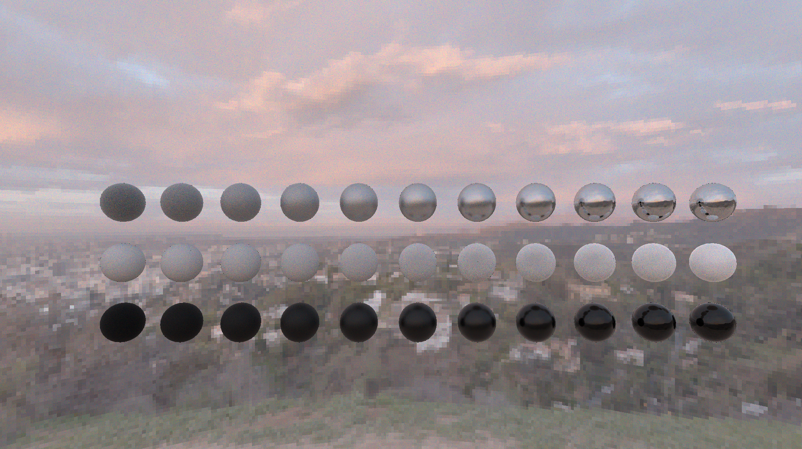
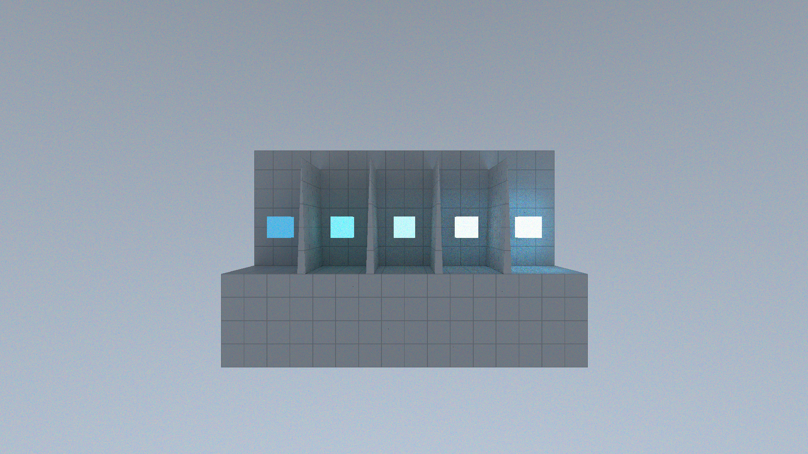

# CrystalGraphics

A "real-time" _spectural_ _pathtracing_ rendering engine written with `C++23` & `glm` & `Webgpu`.

| | |
|-|-|
|||
|||

## QuickStart

### Standalone Tool

```shell
$ git clone https://github.com/ray847/CrystalGraphics.git --depth 1
$ cd CrystalGraphics
$ mkdir build
$ cmake -S . -B build
$ cmake --build build
$ ./build/main

CrystalGraphics Standalone Example
This example will render a glTF file stationary for 5 seconds then start rotating.
Usage: ./main path/to/your/glTF/file
  (-h ; prints this message)
  (-t number of seconds to run;           defaults to 10)
  (-d camera distance to origin;          defaults to 1.0)
  (-o (x, y, z) camera rotation origin;   defaults to (0.0, 0.0, 0.0))
  (--window-width width;                  defaults to 1920)
  (--window-height height;                defaults to 1080)
  (--render-width width;                  defaults to 1280)
  (--render-height height;                defaults to 720)
  (--sample-count count;                  defaults to 1)
  (--trace-depth depth;                   defaults to 2)
  (--max-transport-samples count;         defaults to 3)
  (--max-diffuse-samples count;           defaults to 1)
  (--max-rough-samples count;             defaults to 1)
  (--max-emission-samples count;          defaults to 1)
```

### Library Usage
```cpp
#include <cstdlib>

#include <chrono>
#include <expected>
#include <iostream>

#include <CrystalGraphics/graphics.h>

/**
 * Extract the value from a `std::expected` if the value is present, otherwise
 * terminate the program.
 */
template <typename T>
T ExpectedVal(std::expected<T, std::string>&& expected) {
  if (!expected) [[unlikely]] {
    std::cerr << expected.error() << std::endl;
    exit(EXIT_FAILURE);
  }
  if constexpr (!std::is_same_v<T, void>) return std::move(*expected);
}

/**
 * Main function.
 */
int main() {
  /* Initialize environment. */
  ExpectedVal(crystal::graphics::EnvInit());
  auto scene = ExpectedVal(crystal::graphics::LoadScene(
      R"(path/to/your/scene.gltf)" // replace this with your gltf file!
  ));

  /* Run for some seconds. */
  crystal::graphics::Camera camera{
    .position = { 0.0, -2.0, 0.0f },
    .direction = { 0.0, 1.0, 0 },
    .viewport = { 1.960, 1.080 }
  };
  uint64_t counter = 0; // frame counter
  auto st = std::chrono::high_resolution_clock::now();
  while (std::chrono::high_resolution_clock::now() - st
         < std::chrono::seconds(30)) {
    ExpectedVal(crystal::graphics::EnvPoll()); // poll window
    ExpectedVal(crystal::graphics::View(scene, camera)); // render frame
    ExpectedVal(crystal::graphics::EnvPresent()); // present frame
    counter++;
  }
  std::cout << "Frame Count: " << counter << std::endl;

  /* Terminate environment. */
  ExpectedVal(crystal::graphics::EnvTerm());

  return EXIT_SUCCESS;
}
```

## Example

Renders are available in [the example directory](doc/example/).

**All glTF scene files used can be found in https://github.com/KhronosGroup/glTF-Sample-Assets.**

## Feature

* Spectral Pathtracing with Wavelength Sampling
* CIE XYZ color space
* Diffuse & (Rough/Specular) Reflection & Transmission BSDF Model
* glTF Scene Loading
* BVH software acceleration
* WebGPU Compute Backend

## Build & Integration

### Standalone Build

A standalone build will create a executable in your build directory that renders a glTF scene with a few customizable arguments.

### Library Integration

The recommended way to integrate this library is with the `CMake` build system:

```shell
git clone https://github.com/ray847/CrystalGraphics.git --depth 1
```

```cmake
add_subdirectory(path/to/cloned/repo)

target_link_libraries(YourTarget
  PRIVATE
  CrystalGraphics
)
```

or with `FetchContent`:
```cmake
include(FetchContent)
FetchContent_Declare(
  CrystalGraphics
  GIT_REPOSITORY https://github.com/ray847/CrystalGraphics.git
  GIT_TAG "origin/main"
)
FetchContent_MakeAvailable(CrystalGraphics)

target_link_libraries(YourTarget
  PRIVATE
  CrystalGraphics
)
```

## API Document

There are no deliberately written documents for the api, though a doxygen path is provided.

```
$ git clone https://github.com/ray847/CrystalGraphics.git --depth 1
$ cd CrystalGraphics
$ doxygen Doxyfile
```

## Technical Document

Please refer to [the full document](doc/doc.pdf).

The document covers:
* Light Transport Physics
* Light Transport Modeling
* Implementation Details & Decisions

## Toolchain & Dependent Libraries

**Builtin / Required**:
* `C++23`: Primary Programming Language
* `WebGPU` & `WGSL`: Render Backend
* `WESL`: Modular WGSL Toolchain
* `glfw`: Window Management
* `stb`: Texture Processing
* `cgltf`: glTF File Parsing
* `glm`: Linear Algebra Library

**Used in Development**
* `wesl`: WESL Compiler
* `doxygen`: API Document Generator
* `g++` & `MinGW`: C++ Compiler (The code is intentionally written to be cross-compiler compatible though no testing have been done. Also compiler support for C++23 may vary.)
* `clangd`: Language Server
* `vscode` & `neovim`: Code Editor

## Project Overview

```shell
CrystalGraphics
├───doc                     # documents
│   ├───asset               # project-wide assets
│   ├───autogen             # generated doc files (e.g. Doxygen)
│   ├───doc.pdf             # technical document
│   ├───example             # render examples
│   ├───todo.md             # internal todo list
│   ├───project_overview.md # this file
│   └───...
├───include/CrystalGraphics # include source files
├───lib                     # dependent libraries
├───src                     # implementation source files
├───.clang-format           # C++ formatting config file
├───.gitignore
├───CMakeLists.txt          # CMake build system file
├───Doxyfile                # Doxygen config file
├───main.cpp                # standalone executable source file
├───Makefile                # WESL -> WGSL compilation
└───README.md

```